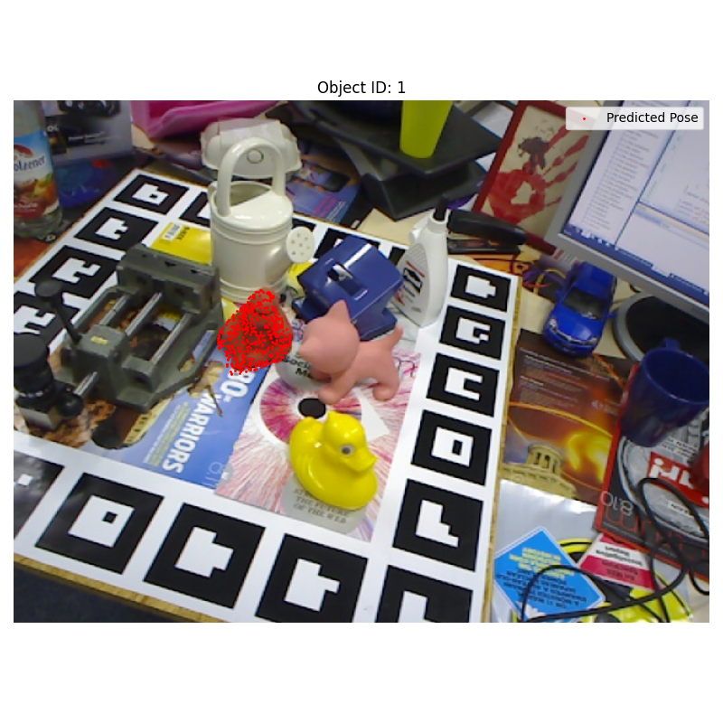

# 6DPose_Enhancement

This is a Computer Vision project devoted to the enhancement of a 6D pose extimation model with deep machine learning models. Our 6D pose estimation pipeline consists of several stages, as illustrated below.

<p align="center">  </p>

First, the RGB image is processed by a YOLO detector to localize the object and crop the region of interest. The corresponding depth image is used to sample 3D points from the cropped area. Color features are extracted from the cropped RGB using a CNN, while 3D coordinates are obtained from the depth data. These features are combined and used to construct a graph, where nodes represent sampled points and edges are built using k-nearest neighbors (KNN). The graph is then processed by a stack of Graph Isomorphism Network (GIN) layers to fuse features. Finally, the fused features are passed to the PoseNet, which predicts the 6D pose (rotation and translation) of the object.

## Initial Setup

This project is tested and recommended with:

- **Python 3.10**
- **CUDA 12.1** (for GPU-enabled setups with PyTorch)

### Automated Setup Options

You can use the provided setup scripts to create a virtual environment and install all dependencies automatically:

### For Linux/macOS:

```bash
# From the project root directory
bash setup_env.sh
```

This will create a `.venv` folder outside the repo (in the parent directory) to avoid cluttering and activate the Python 3.10 environment.

- It also install PyTorch 2.2.2 with CUDA 12.1, DenseFusion, Ultralytics, and additional dependencies.

To activate it later:

```bash
source ../.venv/bin/activate
```

### For Windows (CMD):

```cmd
:: From the project root directory
setup_env.bat
```

This will create a `.venv` folder inside the project that uses `python3.10` if it's available in your PATH.

- It also installs all required packages including PyTorch, Ultralytics, and related libraries.

To activate the environment later:

```cmd
.venv\Scripts\activate.bat
```

## Dataset Testing

The correct dataset loading can be verified by running the dataset_test.py file found in the dataload folder using the command

`python3.10 dataload/dataloader.py`

The output will be stored in the plot/testing directory

## YOLO model Training and Testing

This section describes how to train a YOLO11n model for object detection on the Linemod dataset and evaluate its performance.

In all the 3 following scripts there are many optional args, check them!

### 1. Export Dataset to YOLO Format

Before training, convert the preprocessed Linemod dataset into the format required by YOLO.

`python dataload/yolo_export.py`

### 2. Finetune the model

`python models/yolo/train.py`

### 3. Evaluate

will save a detailed report in models/yolo/test_results

`python models/yolo/test.py --weights models/yolo/runs/detect/linemod_finetune/weights/best.pt`

## Training the Model

To train the 6D pose estimation model on the Linemod dataset, use the provided training script:

```bash
bash experiments/scripts/train_linemod.sh
```

or, if you want to run it manually:

```bash
python3.10 ./models/denseBase/train.py --dataset linemod --dataset_root path/to/linemod/dataset
```

**Key parameters:**

- `--dataset`: Dataset to use. For Linemod, set to `linemod`.
- `--dataset_root`: Path to the root directory of the preprocessed dataset.
- `--batch_size`: Number of samples per batch (default: 32).
- `--workers`: Number of worker processes for data loading (default: 4). Increase for faster data loading if you have enough CPU cores.
- `--lr`: Initial learning rate (default: 0.0001).
- `--lr_rate`: Learning rate decay rate (default: 0.3).
- `--w`: Weight for the loss function (default: 0.015).
- `--w_rate`: Weight decay rate (default: 0.3).
- `--decay_margin`: Margin to trigger learning rate and weight decay (default: 0.016).
- `--noise_trans`: Range of random translation noise added to training data (default: 0.03).
- `--nepoch`: Number of training epochs (default: 500).
- `--resume_posenet`: Path to a checkpoint to resume PoseNet training from.
- `--start_epoch`: Epoch number to start training from (default: 1).
- `--gnn`: Add this flag to use the GNN-based model instead of the standard DenseFusion.
- `--feat`: Allows you to specify which feature will be used in the nodes of the graph (default: "color").

**Example:**

```bash
python3.10 ./models/denseBase/train.py --dataset linemod --dataset_root path/to/linemod/dataset --batch_size 16 --workers 8 --gnn
```

## Evaluating the Model

After training, evaluate your model's performance using the evaluation script:

```bash
bash experiments/scripts/eval_linemod.sh
```

or manually:

```bash
python3.10 ./models/denseBase/eval_linemod.py --dataset_root path/to/linemod/dataset --model checkpoints/linemod/pose_model_current.pth
```

**Key parameters:**

- `--dataset_root`: Path to the root directory of the preprocessed dataset.
- `--model`: Path to the trained PoseNet model checkpoint (`.pth` file).
- `--num_points`: Number of points to sample from the input point cloud (default: 500).
- `--gnn`: Add this flag to evaluate a GNN-based model.
- `--batch_size`: Batch size for evaluation (default: 1).
- `--no_cuda`: Add this flag to force evaluation on CPU even if a GPU is available.

**Example:**

```bash
python3.10 ./models/denseBase/eval_linemod.py --dataset_root path/to/linemod/dataset --model checkpoints/linemod/pose_model_current.pth --gnn
```

**Output:**

- The script prints per-object and overall success rates and mean distances.
- Detailed logs are saved in eval_result_logs.txt.

## Visualizing Pose Estimates

To visualize pose predictions for each object, use the plotting script:

```bash
bash experiments/scripts/plot_eval_linemod.sh
```

or manually:

```bash
python3.10 ./models/denseBase/plot_inference.py --dataset_root path/to/linemod/dataset --model checkpoints/linemod/pose_model_current.pth
```

**Key parameters:**

- `--dataset_root`: Path to the root directory of the preprocessed dataset.
- `--model`: Path to the trained PoseNet model checkpoint (`.pth` file).
- `--output_dir`: Directory where the visualization images will be saved (default: eval_linemod).
- `--num_points`: Number of points to sample for visualization (default: 500).
- `--img_size`: Size of the output images (default: 480).
- `--gnn`: Add this flag to visualize using the GNN-based model.

**Example:**

```bash
python3.10 ./models/denseBase/plot_inference.py --dataset_root path/to/linemod/dataset --model checkpoints/linemod/pose_model_current.pth --output_dir plots/eval_linemod --img_size 640
```

**Output:**

- The script saves images with projected 3D model points overlaid on the RGB images for each object.
- Images are saved in the specified `output_dir`, organized by model checkpoint.

<p align="center">  </p>

**Note:**  
For all scripts, you can view additional optional arguments and their defaults by running with `--help`, e.g.:

```bash
python3.10 ./models/denseBase/train.py --help
```
